<div align="center">
  
  <h1>Chatlog Web</h1>
  <p><strong>每一段对话，都值得留存。</strong></p>
  <p>一个安静、清晰、由你掌控的聊天档案工作台。</p>
  <p>简体中文 · <a href="README_EN.md">English</a> · <a href="UI-REDESIGN.md">设计与实现</a> · <a href="LOCAL-TEST-REPORT.md">本地档案验证</a></p>
</div>

Chatlog Web 是聊天档案阅读器，支持连接 [chatlog](https://github.com/sjzar/chatlog) HTTP 服务，或导入用户自行准备的已解密微信 4.x SQLite 数据库。新版以纸白与松绿色为主，提供统一的七个业务页面、数据来源管理、深色模式和移动端布局。

> **免责声明：** 本项目不包含数据破解代码或教程，不调用密钥提取工具。数据以及可选的后端服务由使用者自行提供，请仅处理有权访问的数据。界面为只读档案，不会发送聊天消息。

## 界面预览

以下图片由**生产构建运行后的 Chromium 页面**截图生成，不是设计效果图。人物、聊天内容、图表和媒体均为明确标注的虚构演示样本，未连接私人聊天数据。图片保存在仓库 `images/ui/`，生成入口见 `tests/browser-smoke.py`。

### 总览 · 从散落的对话，到自己的档案

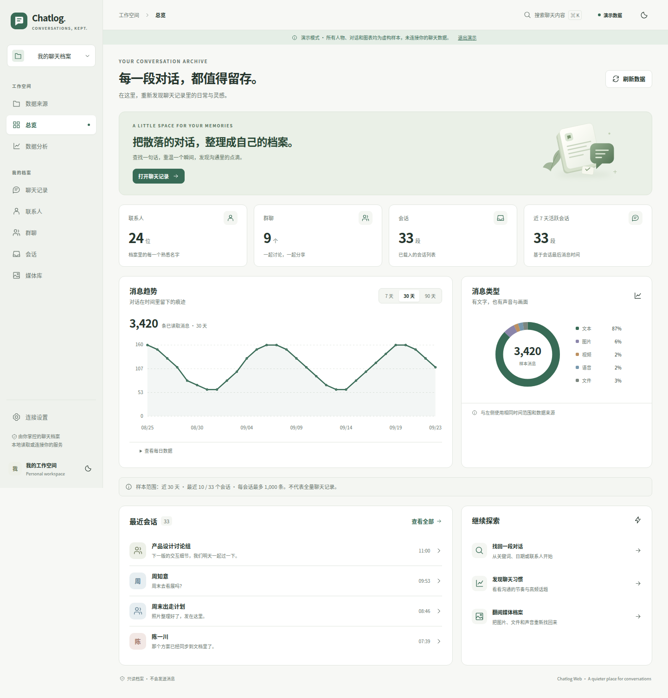

### 聊天记录 · 左侧找人，右侧阅读

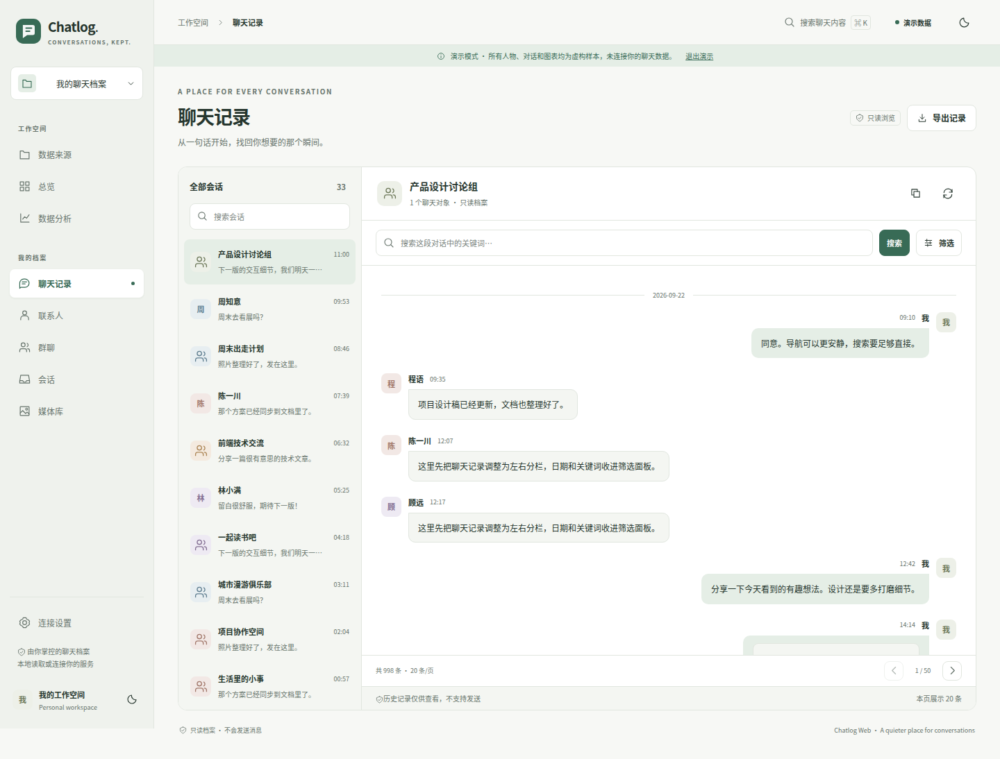

### 数据分析 · 看见沟通的节奏

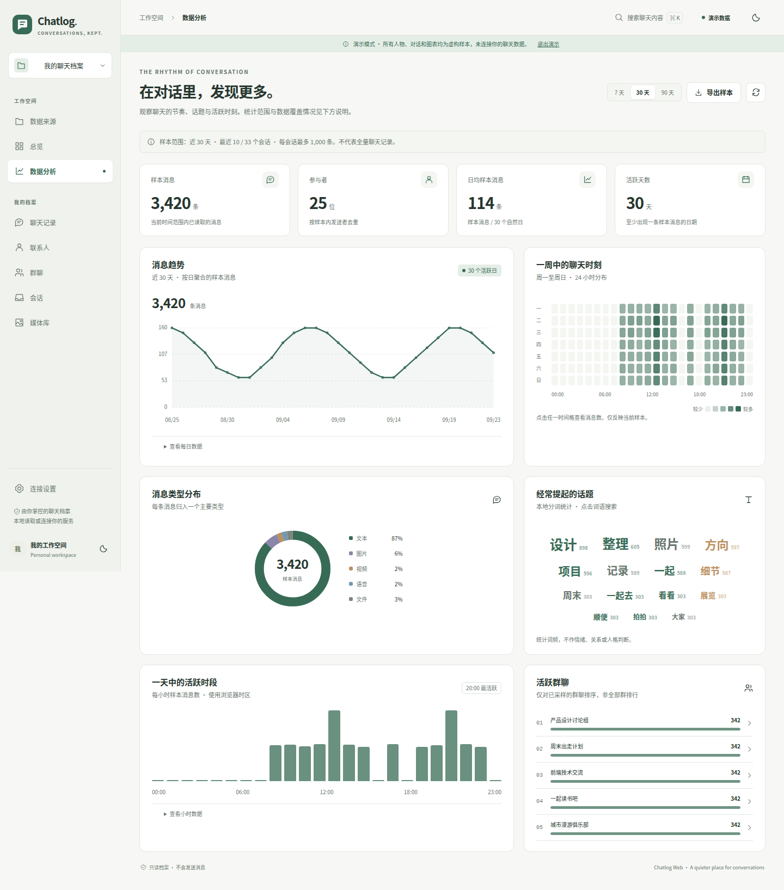

### 媒体库 · 文字之外的那些瞬间

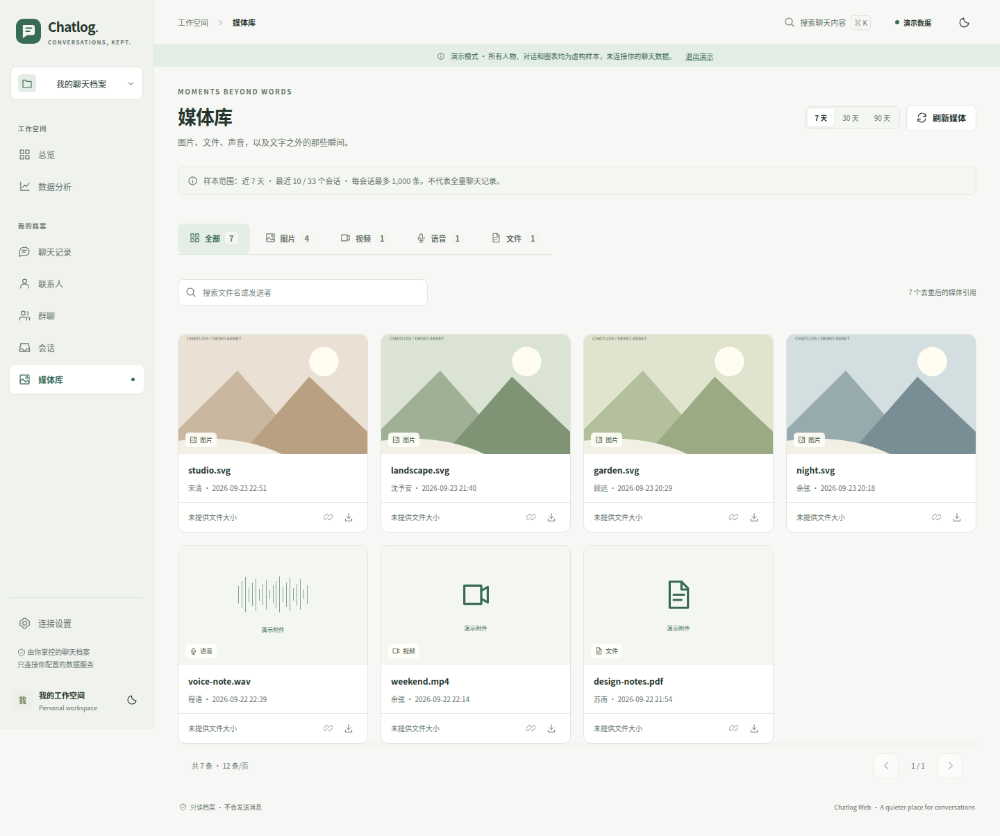

<details>
<summary>联系人、群聊与会话</summary>

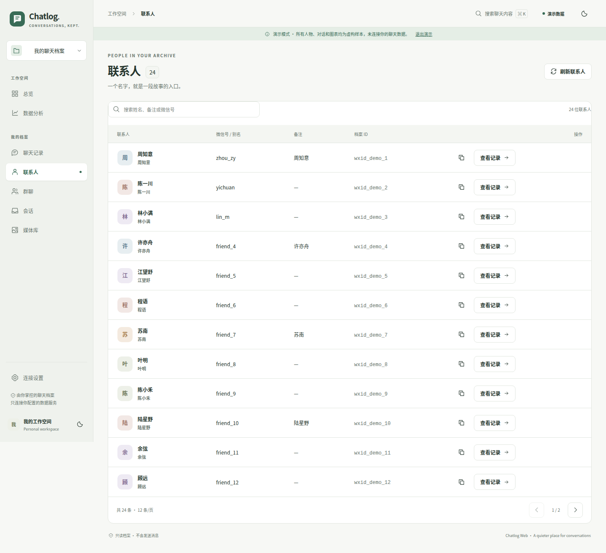
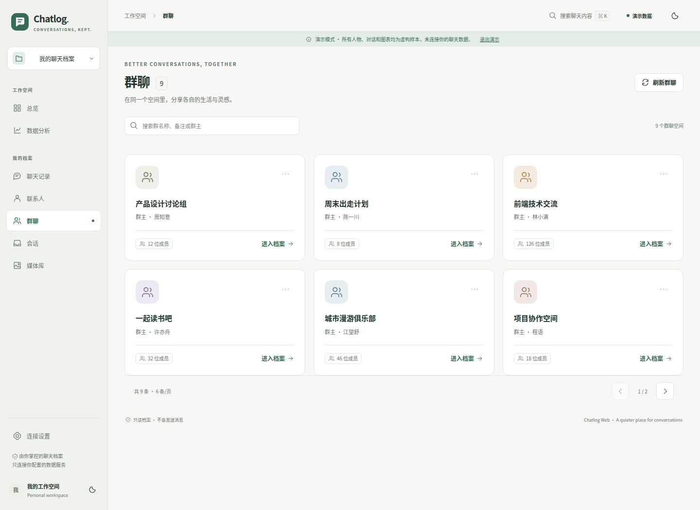
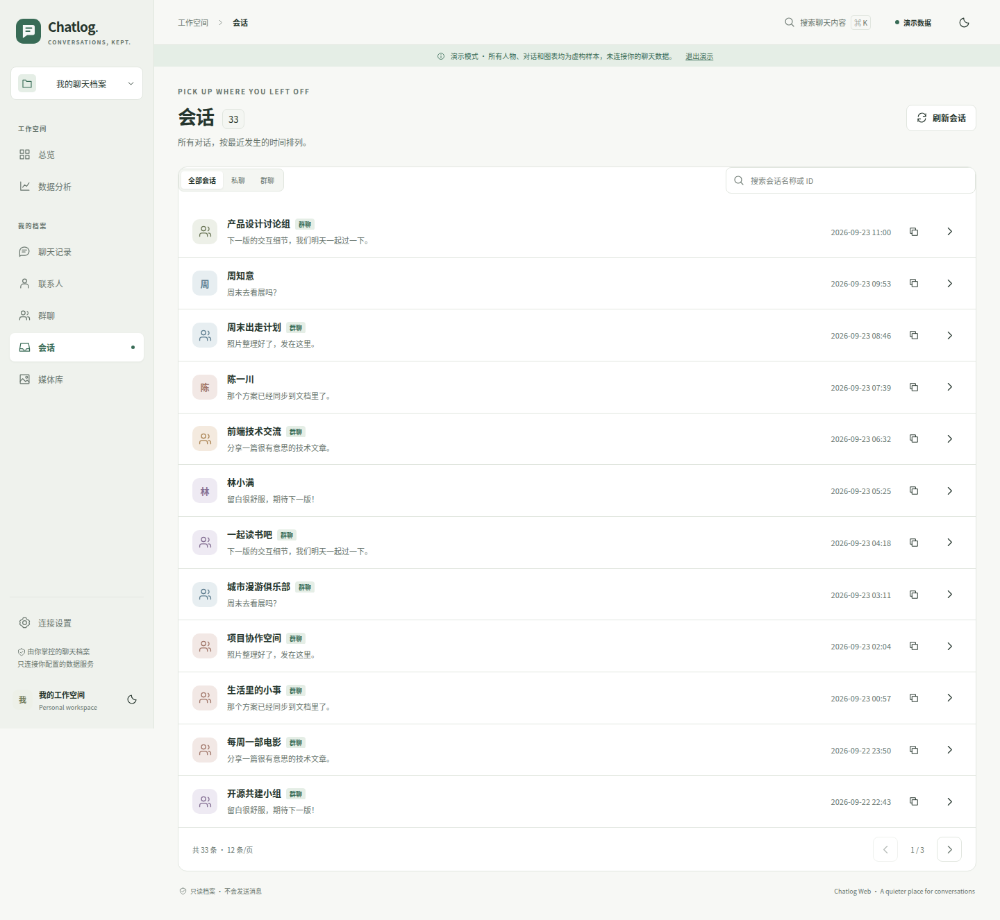

</details>

<details>
<summary>深色模式</summary>

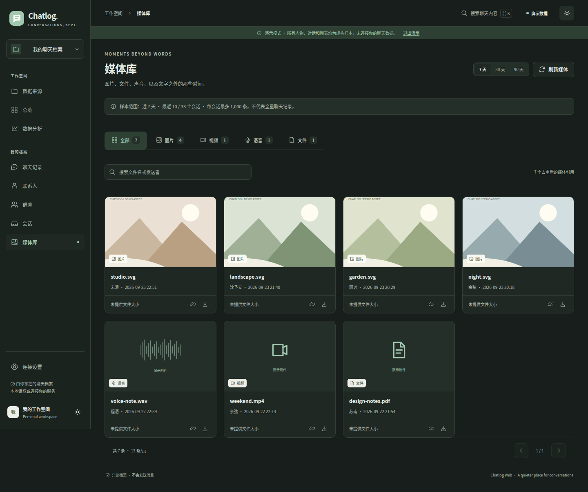

</details>

### 移动端

<p>
  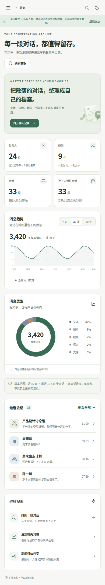
  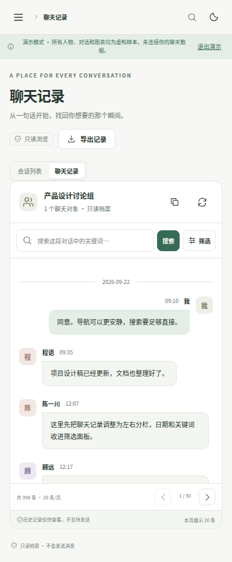
  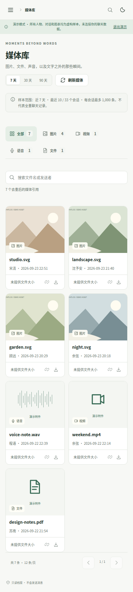
</p>

## 两种数据来源

**连接 chatlog HTTP 服务**，或在「数据来源」中**导入已经解密的本地微信 4.x SQLite 数据库**。本地解析在浏览器 Worker 中运行，不调用密钥提取工具，不上传聊天数据。联系人、会话、多分片消息、搜索、统计与媒体引用使用同一套页面。

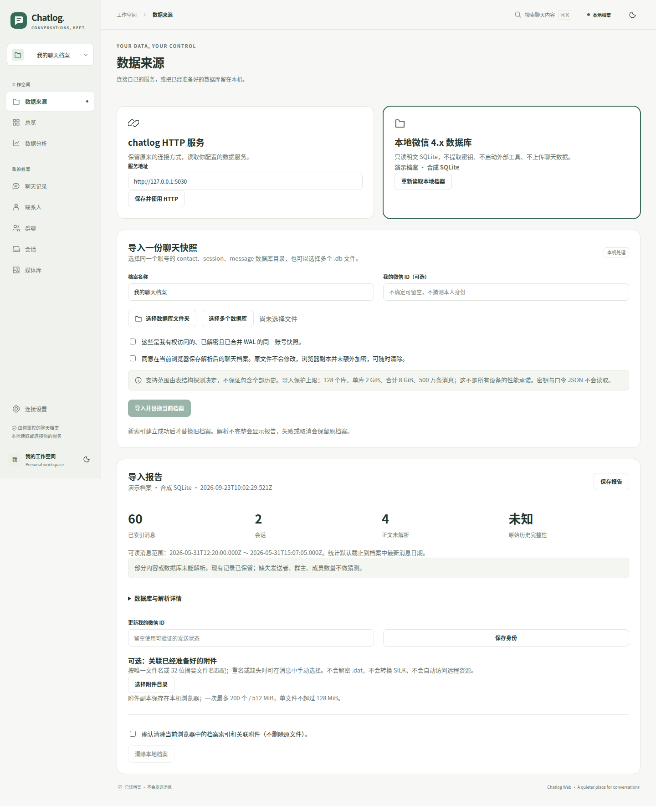

<details><summary>本地聊天、媒体与移动端</summary>

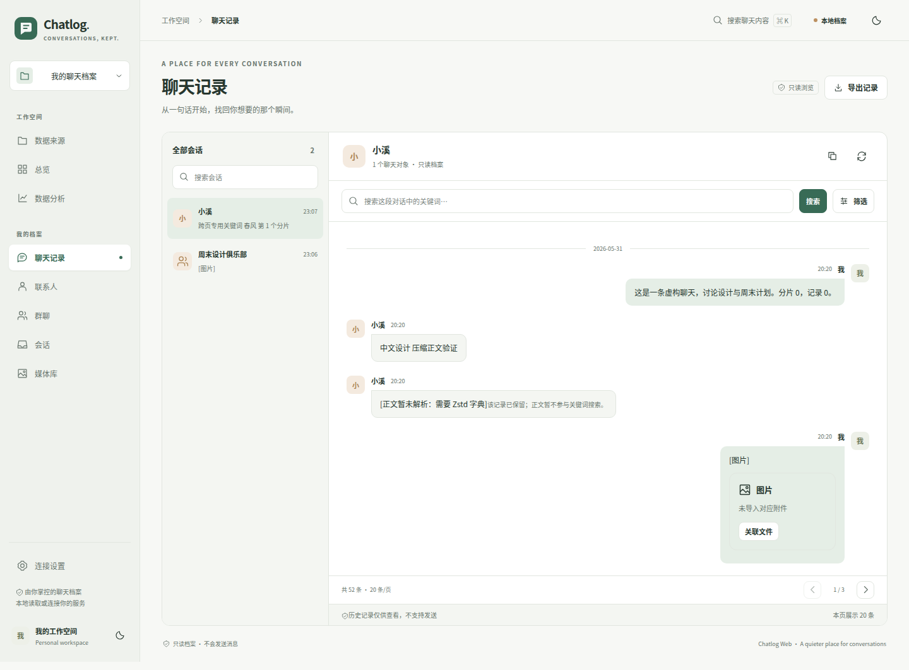
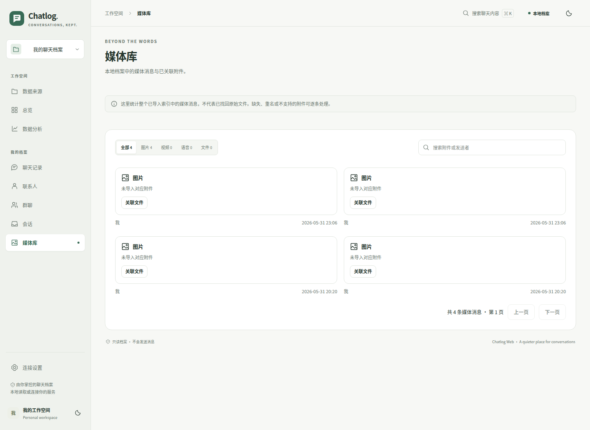
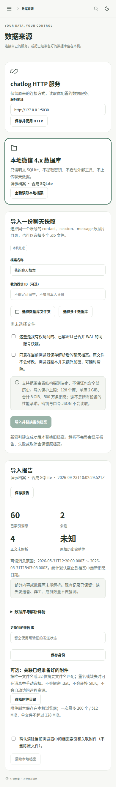

</details>

需要 HTTPS 或 localhost、OPFS 支持和存储权限；浏览器副本没有额外加密。选择目录时需确认是同一账号的明文一致快照。未知结构、缺失附件、字典压缩正文会明确提示，不承诺全部版本或完整历史恢复。截图仅使用合成 SQLite fixtures。

导入方法、隐私边界、大小限制、兼容性与验证：[本地档案说明](docs/LOCAL-ARCHIVE.md)。

## 功能

| 页面 | 能做什么 |
| --- | --- |
| `/sources` 数据来源 | HTTP / 本地切换；数据库导入、进度与取消；覆盖报告、附件关联和清除浏览器档案 |
| `/dashboard` 总览 | 联系人、群聊、会话摘要；消息趋势；最近会话；快捷入口 |
| `/chatlog` 聊天记录 | 对象与日期查询、关键词搜索、安全高亮、分页、媒体预览、CSV / JSON / 文本导出 |
| `/analytics` 数据分析 | 7 / 30 / 90 天统一范围；HTTP 有限采样或本地已导入索引统计；趋势、类型、小时热力图、词频与群聊排行 |
| `/contacts` 联系人 | 目录搜索、详情、复制 ID、进入对应聊天记录 |
| `/chatrooms` 群聊 | 空间卡片、成员与群主信息、详情、分页 |
| `/sessions` 会话 | 按最近消息排列、私聊 / 群聊过滤、搜索 |
| `/media` 媒体库 | 媒体引用、分类、搜索；HTTP 资源预览或本地已关联附件预览 |

公共能力：`⌘ / Ctrl + K` 搜索、连接设置、浅色 / 深色主题、手机导航、键盘焦点、加载 / 错误 / 空状态。39 枚原创线性 SVG 图标来自 `src/lib/icons.js`，不依赖图标字体。

## 快速开始

开发和 CI 使用 Node.js 22。按仓库锁文件安装：

```bash
npm ci
npm run serve
```

打开 `http://localhost:8080`。使用本地数据时，进入侧栏「数据来源」或 `/sources`，选择已经解密、已合并 WAL 的同一账号数据库快照，无需启动 chatlog 后端。

无需后端或数据库体验界面时，可显式开启演示：

```text
http://localhost:8080/dashboard?demo=1
```

**演示必须显式开启。** 未连接服务或请求失败，不会自动填充演示数据。演示附件中的音频、视频与文档只展示交互状态，不提供真实文件。

使用 HTTP 来源时，请按 [chatlog 后端文档](https://github.com/sjzar/chatlog) 准备并启动自己的服务。开发代理默认连接 `http://127.0.0.1:5030`；可设置 `CHATLOG_PROXY_TARGET` 修改代理目标。界面侧栏“连接设置”可保存浏览器直连地址，留空使用同源代理。

## 生产部署

```bash
npm run build
```

部署 `dist/` 到静态 Web 服务器，并将前端路由回退到 `index.html`。默认部署在 `/`；子目录部署需构建时设置绝对路径，例如 `VUE_APP_PUBLIC_PATH=/chatlog/`，同时配置对应目录的路由回退。

本地数据库来源需要 HTTPS 或 localhost，并允许 OPFS 存储。JavaScript 和 WASM 静态资源仍需正常加载；不上传聊天数据不等于已经实现离线 PWA。

以下连接配置仅针对 **HTTP 来源**：`VUE_APP_API_BASE_URL` 可在构建时指定 API 地址。未配置时生产环境默认连接 `http://127.0.0.1:5030`；这里指**访问网页的设备**。远程访问建议配置同源 HTTPS 反向代理，并在连接设置中留空。浏览器直连跨域服务需要后端允许 CORS；HTTPS 页面直连 HTTP 可能被拦截。不要把无鉴权的私人聊天服务暴露到公网。

## 数据范围与隐私边界

| 项目 | HTTP 来源 | 本地数据库来源 |
| --- | --- | --- |
| 统计与媒体范围 | 最近 10 个会话，每个最多 1,000 条，并显示采样、失败与截断提示 | 选定日期范围内整个已导入索引；默认截止到档案最新消息日期，不等于上游全部历史 |
| 关键词搜索 | 主关键词由后端查询；追加 AND / OR 仅筛选当前返回页 | 所有关键词在本地索引层过滤后再分页，支持中文短词与字面量子串 |
| 聊天内容存储 | 应用不持久化 HTTP 返回的聊天正文；加载内容暂存在页面内存 | 经确认后，解析的正文与索引持久化在当前站点的 OPFS；明确关联的附件保存在 IndexedDB |
| 媒体 | 非当前数据服务来源的预览需要确认；主动打开资源链接会连接对应服务器 | 不自动请求外部媒体；只使用用户明确关联的本地附件 |

两种来源的查询导出均有 5,000 条上限，达到上限会提示。未解码正文仍计入本地消息数量，但不参与正文搜索和词频；其他解析与资源限制见 [本地档案说明](docs/LOCAL-ARCHIVE.md)。

**本地浏览器副本没有额外的应用层加密。** 请信任部署来源并避免在公共电脑上导入，使用「数据来源」中的清除入口可删除本机档案索引与关联附件，不修改源文件。浏览器可能回收站点数据，源文件应自行保留备份。导出的文件包含聊天内容，请自行妥善保管。

未提供的文件大小、群成员数与日期保留未知，不随机填值。空数据与连接失败分别处理；不计算虚构的“响应率”。聊天正文按文本渲染，关键词按字面匹配，不把内容直接拼接为 HTML。导入成功不代表历史完整，未知结构或无法解析的数据会明确提示。

## 验证与截图更新

```bash
npm ci
node --test tests/*.test.mjs
npm run lint -- --no-fix src
npm run build
python -m pip install playwright==1.52.0 pillow
python -m playwright install --with-deps chromium
python tests/browser-smoke.py
python tests/browser-local.py
```

浏览器脚本检查实际 `dist/` 页面，分别生成 `images/ui/` 的演示截图和 `images/wcdb/` 的本地档案截图。两套测试均不使用私人聊天数据。本地测试通过实际 SQLite 文件、Worker、WASM 和 OPFS 运行，不以模拟接口替代数据库导入。

CI 包括 [UI validation](.github/workflows/ui-validation.yml) 和 [Local archive validation](.github/workflows/local-archive.yml)。PR 和主分支验证不自动修改代码。截图来源及已完成的检查项分别记录在 [`images/ui/manifest.json`](images/ui/manifest.json) 和 [`images/wcdb/manifest.json`](images/wcdb/manifest.json)。更新截图后请一并提交图片和清单。

真实 chatlog 服务、特定微信数据库结构、Safari / Firefox、手机真机及多 GiB 档案性能仍需在实际环境验收。详见 [TEST-REPORT.md](TEST-REPORT.md) 与 [LOCAL-TEST-REPORT.md](LOCAL-TEST-REPORT.md)。

## 项目结构

```text
src/
  api/           HTTP 请求与统一数据源入口
  data-sources/  来源选择、Worker 客户端和附件存储
  workers/       本地 SQLite 导入与查询 Worker
  components/    UI、图表、消息与附件组件
  layout/        导航、主题、全局搜索与设置
  lib/           解析、统计、状态、图标；wcdb/ 为数据库适配
  styles/        统一 token 与响应式样式
  views/         七个业务页面与数据来源管理
public/brand/    原创 SVG 品牌与演示素材
tests/          核心 / 数据库测试与生产页面浏览器检查
images/ui/      界面演示图与来源清单
images/wcdb/    本地 SQLite 导入运行图与来源清单
```

当前界面使用 Vue 3、Vue Router、原生 HTML / SVG 与 CSS，沿用 Vue CLI 工程。本地来源使用官方 SQLite WASM。旧版依赖暂时保留以避免无关迁移，旧 Vuex 文件不再由入口加载。旧版说明存档于 [docs/legacy](docs/legacy)，其中功能描述不代表当前实现。

## 贡献与许可证

欢迎通过 [Issues](https://github.com/sinyu1012/chatlog-web/issues) 和 PR 反馈。提交前请运行上面的检查，并避免上传真实聊天数据。参阅 [贡献指南](CONTRIBUTING.md) 和 [历史更新](CHANGELOG.md)。

本项目采用 [Apache License 2.0](LICENSE)。感谢 [chatlog](https://github.com/sjzar/chatlog)、[Vue](https://vuejs.org/) 以及旧版所使用的 Element Plus、ECharts 等开源项目。
